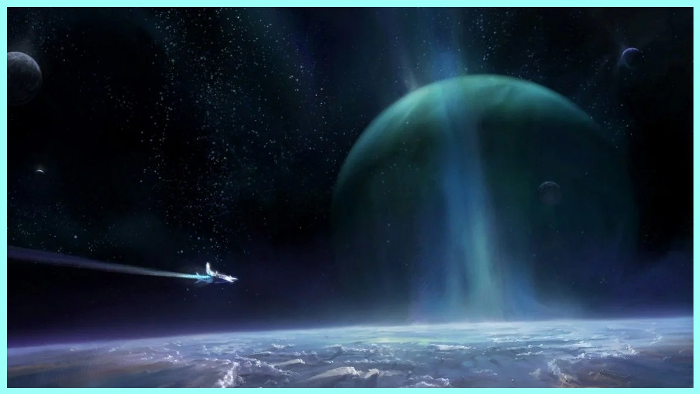

# Chapter 1: Radiance and Ruin

## The Age of Light

In the year 2172, deep within the sulfuric storms of Io, humanity found something that would change its fate forever: a colossal, silent orb suspended above the moon’s surface. It pulsed
with unknowable energy, its surface smooth and unmarred by time. They called it the Traveler.

By 2173, an exploration vessel returning to Earth noticed the orb following them — gracefully, de-liberately. The Traveler had chosen to come with them. By 2178, after years of study and cautious
outreach, humanity finally made contact. The Traveler spoke not in words, but in visions, in bursts of light and understanding. It offered knowledge. Hope.

The Golden Age had begun.

Between 2184 and 2208, the first technologies born of this communion emerged — faster than light travel, gravity manipulation, medical miracles. Whenever the Traveler was present, the tech-
nological advance was astounding. In 2208, the first Exo — a synthetic human mind in a mechanical body — awoke with sentience. It was the dawn of a new era.
By 2210, humanity reached further still, following the Traveler on one of his departures into the unknown, establishing contact with two alien races, one known as the Vifae, a peaceful and ad-
vanced race, and the other known as the Cabal, a warlike culture and technological backwater. The Cabal declared war on first contact and lost to the Earth forces within weeks, but they never forgot
the humiliation. From 2211 to 2492, humanity flourished. Cities floated in the skies of Venus. Oceans were seeded on Mars. Lifespans stretched, and war became a relic of the past. The Traveler, when present, watched, silent and benevolent.
Then, in 2492, after 300 years of prosperity and peace, everything changed.
